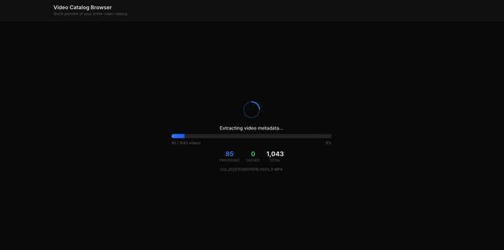
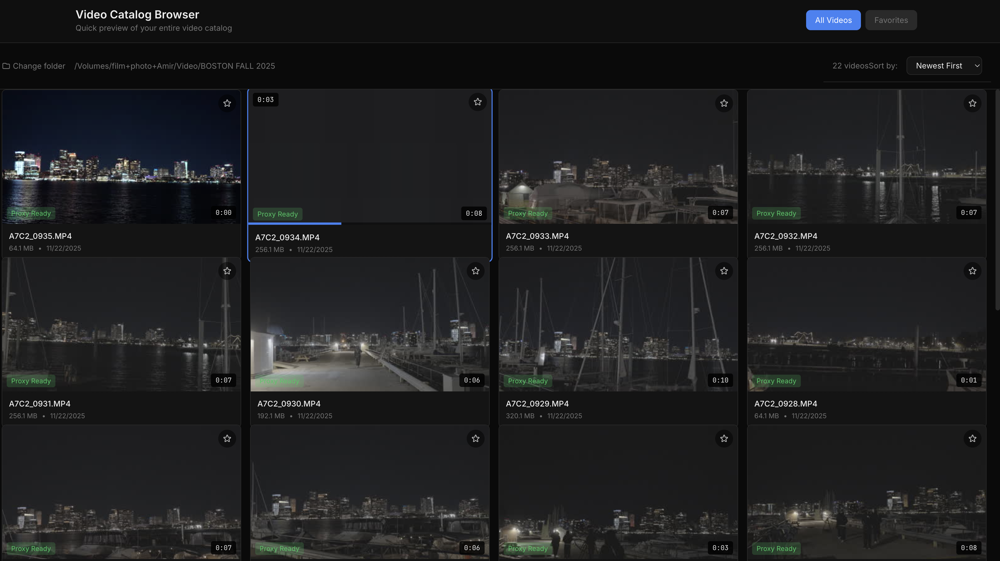

# Video Catalog Browser

A powerful Next.js application for browsing and previewing large video collections stored on external drives. Designed for filmmakers, editors, and content creators who need to quickly find the right clip from massive 4K video libraries.



## Features

### Video Grid with Instant Previews
Browse your entire video library in a clean 4-column grid layout. Each thumbnail shows the video duration, file name, file size, and capture date.



### Hover-to-Scrub
Instantly scrub through any video by hovering over its thumbnail. Uses sprite sheets (not video seeking) for instant response with zero buffering.


### Smart Proxy Generation
Generate 720p proxy files for smooth playback of large 4K videos. The app tracks which videos have proxies with "Proxy Ready" badges.


### Key Capabilities

- **Recursive Video Discovery** - Automatically finds all `.mov` and `.mp4` files in a directory tree
- **External Drive Support** - Designed for external storage with portable database
- **Incremental Scanning** - Previously indexed videos are cached, only new/modified files are processed
- **Smart Sorting** - Sort by date (newest/oldest) or clip duration
- **Favorites System** - Star videos to add them to your favorites collection
- **Large Library Support** - Virtual scrolling optimized for 1000+ video catalogs

## Tech Stack

| Technology | Purpose |
|------------|---------|
| **Next.js 14** | App Router with React Server Components |
| **TypeScript** | Type safety throughout |
| **Tailwind CSS 4** | Dark theme styling |
| **SQLite** | Local-first metadata storage (via better-sqlite3) |
| **FFmpeg** | Video processing, thumbnails, sprites, proxies |
| **TanStack Virtual** | Virtualized grid for large libraries |

## How It Works

### Portable Data Storage
All data is stored in a `.vcb-data/` folder on your source drive:

```
/Volumes/ExternalDrive/Videos/
├── .vcb-data/
│   ├── catalog.db              # SQLite database (travels with drive)
│   └── proxies/
│       ├── {hash}_proxy.mp4    # 720p proxy video
│       ├── {hash}_sprite.jpg   # Hover scrub sprite sheet
│       └── {hash}_thumb.jpg    # Grid thumbnail
├── Folder1/
│   └── Clip001.mov
└── Folder2/
    └── Clip002.mov
```

**Benefits:**
- Database travels with your external drive
- No re-scanning when reconnecting drives
- Each drive maintains its own index

### Hover Scrubbing with Sprites
Instead of seeking through video files (which causes buffering), the app generates 10x10 sprite sheets containing 100 thumbnail frames. Mouse position maps directly to frame index for instant response.

### Skip Reprocessing
Videos are fingerprinted using a hash of the first 64KB + file size + modification time. On re-scan:
- Already indexed videos are skipped
- Modified files are re-processed
- New files are indexed and thumbnailed

## Prerequisites

- **Node.js 18+** (20+ recommended)
- **FFmpeg** installed on your system
- Sufficient storage for proxy files (~10% of original size)

### Install FFmpeg

```bash
# macOS
brew install ffmpeg

# Ubuntu/Debian
sudo apt install ffmpeg

# Windows
choco install ffmpeg
```

## Getting Started

1. **Clone and install dependencies:**
```bash
git clone <repository-url>
cd video-catalog-browser
npm install
```

2. **Run the development server:**
```bash
npm run dev
```

3. **Open [http://localhost:3000](http://localhost:3000)**

4. **Enter your video directory path** (e.g., `/Volumes/ExternalDrive/Videos`)

5. **Wait for scanning** - the app will index all videos and generate thumbnails

6. **Browse and scrub!** - hover over any thumbnail to preview

## Project Structure

```
app/
├── api/
│   ├── scan/route.ts           # Directory scanning endpoints
│   ├── videos/route.ts         # Video listing with sorting
│   ├── videos/[id]/
│   │   ├── stream/route.ts     # Video streaming with range support
│   │   ├── thumbnail/route.ts  # Thumbnail serving
│   │   └── sprite/route.ts     # Sprite sheet serving
│   ├── proxy/route.ts          # Proxy queue management
│   └── selections/route.ts     # Favorites system
├── components/
│   ├── VideoGrid.tsx           # Virtualized 4-column grid
│   ├── VideoCard.tsx           # Individual video thumbnail
│   ├── HoverScrubber.tsx       # Sprite-based hover scrubbing
│   ├── ScanProgress.tsx        # Scan progress with completion sound
│   └── ProxyProgress.tsx       # Proxy generation progress
├── lib/
│   ├── db.ts                   # SQLite database operations
│   ├── ffmpeg.ts               # FFmpeg wrapper (server-side)
│   ├── scanner.ts              # Directory scanning logic
│   └── utils.ts                # Client-safe utilities
└── page.tsx                    # Main application
```

## FFmpeg Commands Used

**Thumbnail Generation:**
```bash
ffmpeg -ss {time} -i input.mov -vframes 1 -vf "scale=384:-1" -q:v 5 output.jpg
```

**Sprite Sheet (100 frames, 10x10 grid):**
```bash
ffmpeg -i input.mov -vf "fps=1,scale=192:-1,tile=10x10" -frames:v 1 output.jpg
```

**720p Proxy:**
```bash
ffmpeg -i input.mov -vf "scale=-2:720" -c:v libx264 -crf 23 -preset fast \
  -tune fastdecode -g 30 -c:a aac -b:a 128k -movflags +faststart output.mp4
```

## Design Decisions

- **Dark Theme Only** - Optimized for video editing workflows
- **SQLite** - Local-first, no external database dependencies
- **Sprite Sheets** - Instant hover response without video buffering
- **720p Proxies** - Balance of quality and performance for scrubbing
- **4-Column Grid** - Optimal thumbnail density for video browsing

## Roadmap

- [ ] Clip selection and export functionality
- [ ] Batch proxy generation parallelization
- [ ] Keyboard navigation (J/K/L scrubbing)
- [ ] Video playback modal with timeline
- [ ] Export selections to JSON/CSV
- [ ] Multi-drive dashboard

## License

MIT
