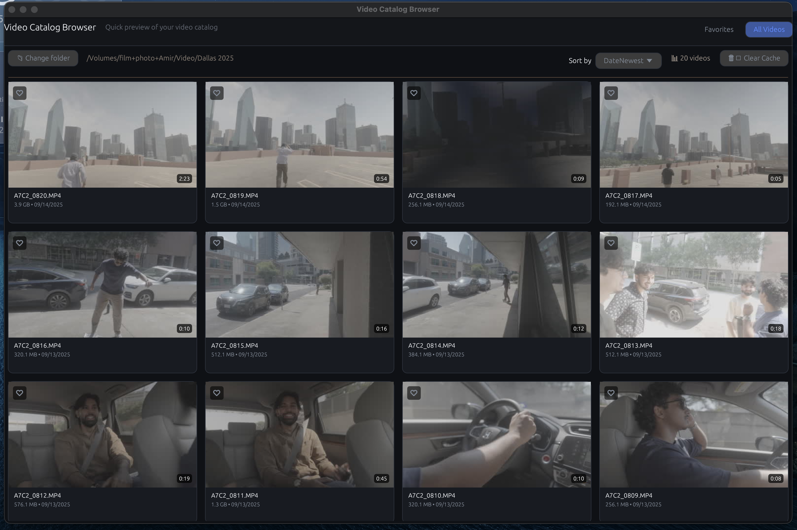
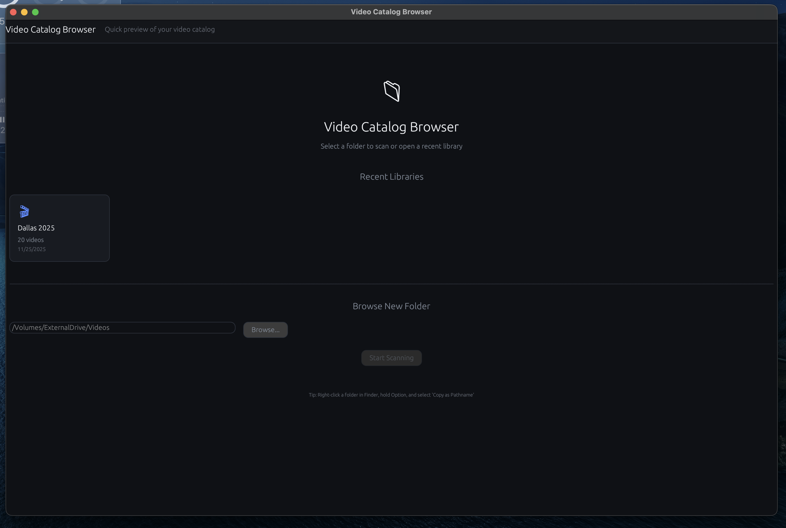
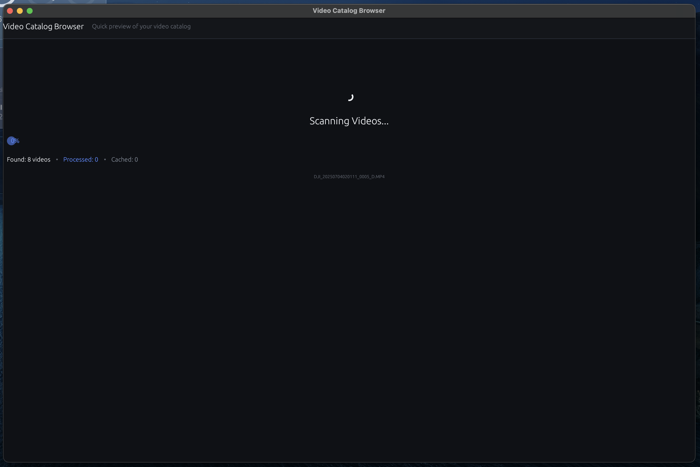

# Video Catalog Browser (Rust Native)

A native desktop application for browsing large video collections on external drives. Built with Rust and egui for instant, responsive video preview without browser limitations.



## Why Rust?

The original Next.js web application struggled with a critical limitation: **browsers cannot efficiently handle raw camera footage**. When working with professional video files (Sony A7C, DJI drones, etc.), Chrome would:

- Fail to decode many codec/container combinations
- Stutter and lag when seeking through large files
- Consume excessive memory trying to buffer multi-GB files
- Require proxy generation just to preview videos

The Rust rewrite solves these problems by:

1. **Direct FFmpeg access** - Decode any video format the system can handle, not just browser-supported codecs
2. **Native performance** - GPU-accelerated rendering with minimal memory overhead
3. **Instant scrubbing** - Background thread decodes frames at cursor position in real-time
4. **No proxy generation needed** - Preview original files directly, even 4K raw footage

## Features

- **4-column grid** with thumbnails extracted directly from source videos
- **Hover-to-scrub** - Move cursor across thumbnail to preview any point in the video
- **Video modal** - Double-click to open full playback with seek bar
- **Favorites** - Mark videos with a heart icon for quick filtering
- **Copy buttons** - One-click copy of filename or full path
- **Library history** - Recently opened folders for quick access
- **Incremental scanning** - Fingerprints files to skip unchanged videos on re-scan



## Requirements

- macOS (tested on Sonoma)
- FFmpeg 7.x installed via Homebrew: `brew install ffmpeg`
- Rust toolchain

## Building

```bash
cargo build --release
```

## Usage

1. Launch the application
2. Browse to a folder containing videos, or select from recent libraries
3. Wait for scanning to complete (progress shown with counts)
4. Browse the grid, hover to scrub, double-click to play



## Architecture

```
src/
├── app.rs          # Main application state and UI
├── main.rs         # Entry point with theme configuration
├── db/             # SQLite database for metadata and favorites
├── scanner/        # Directory scanning with fingerprinting
├── video/          # FFmpeg-based decoding and playback
├── cache/          # GPU texture management
└── settings.rs     # Persistent app preferences
```

## Performance

| Operation | Web (Next.js) | Native (Rust) |
|-----------|---------------|---------------|
| Grid scroll | Laggy with 100+ videos | Smooth at 1000+ |
| Hover scrub | Required sprite sheets | Real-time decode |
| 4K playback | Failed on raw footage | Full speed |
| Memory usage | 2-4 GB | ~200 MB |

## License

MIT
